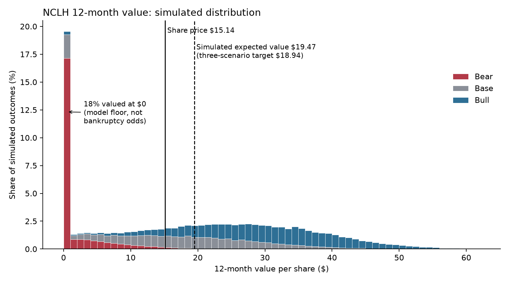
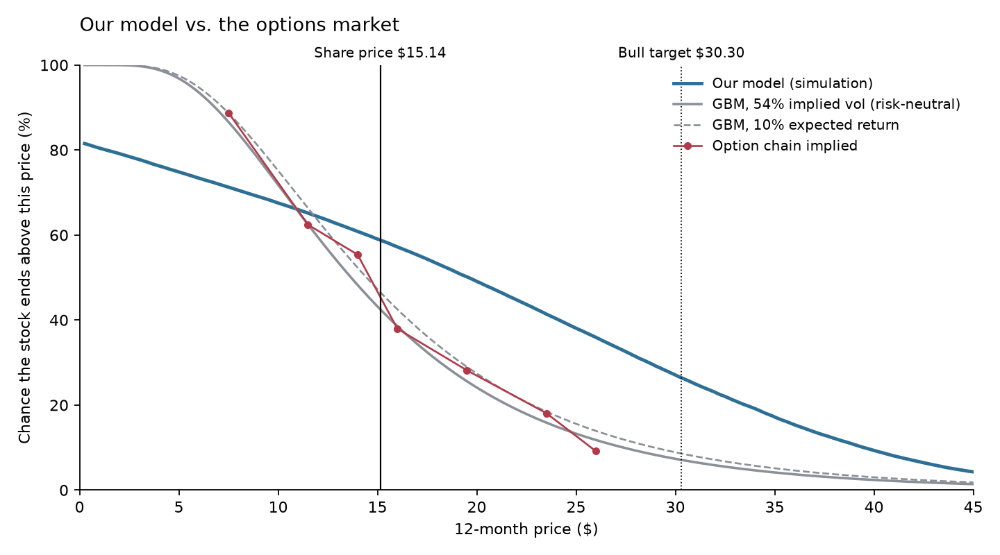

# NCLH 12-Month Value

## Monte Carlo

## Model vs. GBM and the options market

## Methodology 

**Monte Carlo (`main`).** Our workbook values NCLH under bear, base, and bull scenarios, weighted 25/30/45. Each scenario is a single point, and the bear point floors equity at $0, so the three-point average misstates the expected value. The simulation picks a scenario by those weights, then draws 2027-28 net yield growth, NCC ex-fuel growth, fuel price, and advance ticket sales around that scenario's assumptions. Each spread is one standard deviation of historical guidance error. Every draw is priced through a Python replica of the workbook's valuation (2028E adj. EBITDA × target multiple − 2027E net debt, over diluted shares). Before simulating, the replica must reproduce the workbook's three targets($0, $17.67, $30.30). Over 100,000 draws, the expected value is $19.47 against a $15.14 share price. This validates our estimate, or even reveals its moderation. 

**Market cross-check (`market-cross-check`).** This branch compares our outcome distribution with what the market prices for the same 12 months, using two methods: GBM at NCLH's 54% at-the-money implied vol, and risk-neutral probabilities taken from the slope of call prices across strikes on the Sep 2027 option chain (Oct 2, 2026 close), which also captures skew. We use GBM as a benchmark for our previous MC Simulation, as it does not account for the business specifics and cannot reach $0. The gap between curves is our variant.

